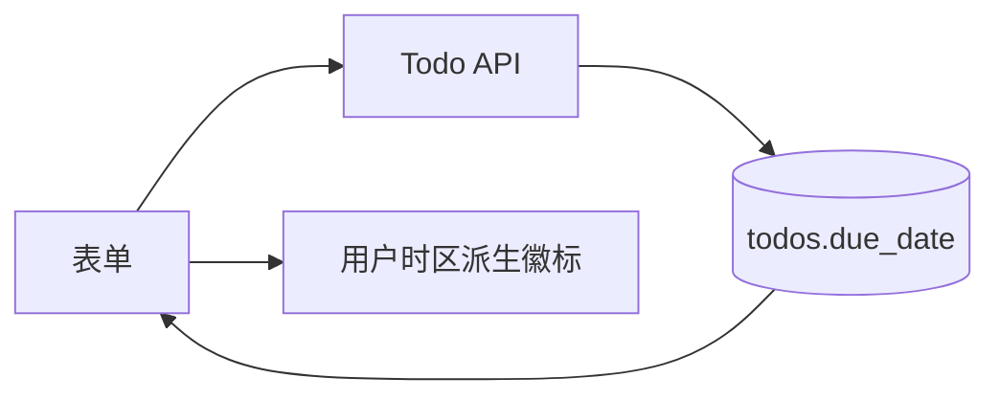

---
spec:
  id: ARCH-due-date
  type: architecture
  version: 1.0.0
  status: approved
  owner: architect
  depends_on: [REQ-due-date]
  artifacts: [ADR-001.md]
  updated: 2026-08-16
---

# 截止日期架构设计

## 边界

- API 和数据库保存原始 `dueDate`，不保存“今天/过期”派生状态；
- 展示层根据用户时区计算徽标；
- 数据库负责日期排序，前端不重复排序；
- 标题识别和快捷日期属于前端建议，不改变 API 契约。

## 数据流

## 关键取舍

时区和派生状态的决策见 [ADR-001](ADR-001.md)。HTTP、数据库和设计的细节分别由 API、Domain 和 Design Spec 负责。
