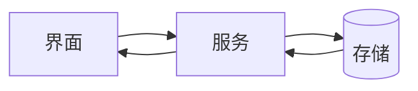

<!--
  模板：架构设计（Architect 维护）
  用法：复制到 spec/architecture/ARCH-<slug>/；不可逆决策写成 ADR-001.md 等。
  铁律：边界写清楚"什么不允许"（依赖方向、禁用项）；低层 Spec 不得违反本节。
  完整示例：examples/todo-due-date/spec/architecture/ARCH-due-date/README.md
-->
---
spec:
  id: ARCH-<slug>
  type: architecture
  version: 0.1.0
  status: draft
  owner: architect
  depends_on: [REQ-<slug>]
  artifacts: [ADR-001.md]
  updated: 2026-01-01
---

# 架构设计：<名称>

## 边界

- <组件边界与依赖方向，例如"只有 API 服务写表，前端禁止直连 DB">；
- <哪些状态是派生的、由谁计算，不落库>；
- <哪些行为属于前端建议、不改变契约>。

## 数据流

## 关键取舍

<每个不可逆决策写一篇 ADR 并在下面索引；备选方案与否决原因也要写——AI 需要知道"为什么不是那个"。>

- `ADR-001`：<决策一句话>

## 约束

<硬性架构约束：低层 Spec（API/DOM/设计/测试）不得违反本节。>
